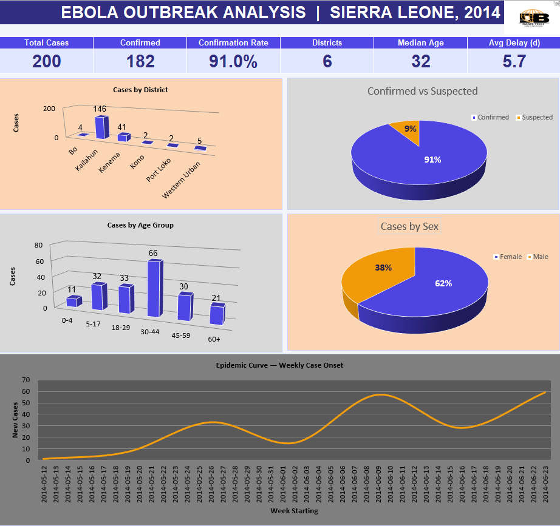
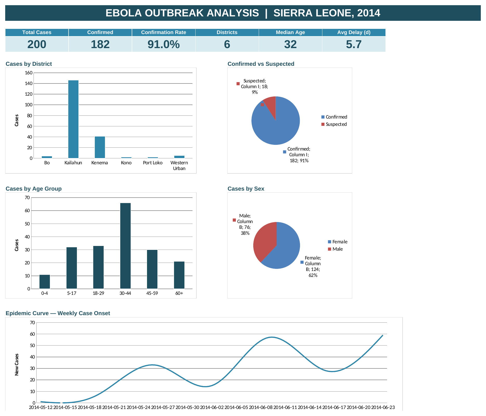

# Ebola Outbreak Analysis — Sierra Leone, 2014

An end-to-end Excel data analysis project: raw line-list data is cleansed, summarized into live formula-driven metrics, and presented as an interactive dashboard.

## Dashboard

### Styled Version

### Original (generated from the workbook)

## Contents

| File | Description |
|------|-------------|
| `ebola_sierra_leone.csv` | Raw case line-list (200 records) |
| `Ebola_Sierra_Leone_Dashboard.xlsx` | Workbook with three sheets: **Dashboard**, **Metrics**, **Data** |
| `assets/dashboard_styled.png` | Styled dashboard preview (with logo) |
| `assets/dashboard_original.png` | Original dashboard preview rendered from the workbook |

## Data Cleansing

- Standardized categories: sex `M`/`F` → `Male`/`Female`; status and district to consistent title case.
- Parsed both date fields to real dates and derived a `Reporting Delay` field (onset → sample).
- Rounded a fractional age (`1.8` → `2`) so all ages are whole years.
- Added derived fields: `Age Group` bands and `Onset Week`.
- Left 7 missing ages blank rather than imputing, to keep counts honest (flagged `Unknown` in the age-group column).
- Verified no duplicate records and no negative reporting delays.

## Key Metrics

| Metric | Value |
|--------|-------|
| Total cases | 200 |
| Confirmed | 182 (91.0%) |
| Suspected | 18 |
| Districts affected | 6 |
| Median age | 32 (mean 33) |
| Female : Male ratio | ~1.6 : 1 (124 vs 76) |
| Avg reporting delay | 5.7 days |
| Outbreak window | 18 May – 29 Jun 2014 (42 days) |

## Summary of Findings

- **Geographically concentrated.** Kailahun (146 cases, 73%) and Kenema (41, 20.5%) together account for ~94% of cases — the eastern outbreak epicenter. The other four districts show only scattered, often suspected, cases consistent with early spillover.
- **High confirmation rate (91%)** suggests strong laboratory follow-up.
- **Demographics.** Cases span ages 2–80; working-age adults (30–44) form the largest band, but children and elderly are affected too.
- **Sex skew toward women** (~1.6:1) — worth investigating (e.g. caregiving exposure).
- **Surveillance timeliness.** Onset-to-sample delay clusters at ~5 days, with one 45-day outlier.
- **Trajectory.** The epidemic curve shows case onsets building through June 2014.

> Note: the dataset has no outcome field (recovered/died), so case-fatality rate cannot be computed. Add outcomes to enable survival metrics.

## How It Works

The **Metrics** sheet drives every chart via live Excel formulas (`COUNTIF`, `COUNTIFS`, `AVERAGE`, etc.). Replace or extend the **Data** sheet and the dashboard recalculates automatically. Delivered with zero formula errors.
